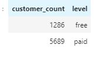
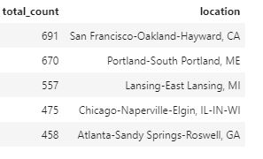

# Sparkify Data Modelling

Sparkify is a new startup company where the data related to the songs, User activity on the streaming app. The file they store is in JSON format. Since the file is in JSON format it is difficult for them to do any analysis in data and get some meaningful insight from the data. Hence the purpose of this project is to come up with a data model and load data into the respective table, which then can be used for the analysis purpose.The analysis can be done regarding to see which songs is getting played more,who is the top artist user listen to,how much time user spend on listeningto  music on the app , in which location the app is used more or how many free and paid customer does the app have.


## Data modeling
We have breakdown the JSON files into 5 different tables namely, Songs, artist, time, user and song play.
Each table represents its own entity for example songs table will have information regarding the song, artist table will have information regarding the artist, user table will consist of information about the user, the time table will consist of dates and time of user activity on the app and song play will have information regarding what song was played by what user and belongs to which artist and so on. The data is broken so that there is no redundant data present across the tables and it will be easy to do analysis.By loading the data into separate table there will be no requirement for heavy joins or joins on multiple table. We can just simply query on a single table and get information regarding that entity.

## How to run:
1. Initially, you need to run the create_table python script as follows:
```python
python creat_table.py
```
This will create the database sparkifydb and all the required table we need for this project.
2. Once the database and table are created you need to run the etl.py script which will read the data from the file and insert it into the respective tables.
```python
python etl.py 
````

## Result:
1. Breakdown of customer based on membership: 
```
 select count(*),level from users group by level
```


2. Top 5 Location with high app usage.
```
select count(*), location from songplays group by location order by count(*) desc limit 5
``` 

